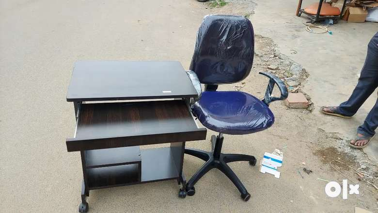

# Guidance_Mantras
A simple page for providing a guidance for all parents, kids and adults in India

# Please read this webpage before taking any decisions in your life

A simple repo for providing guidances for all the kids, adults and parents in India

# My Thoughts
- This web page is only for providing my expierence and knowledge to other people. I am not responsible for your any decisions/your any actions in your life based on this web page informations.
- I am not recommending any application for money here as well.
###### Please read this page once in a week, please also make your kids to read this page once in a week.
### Please do share this web page with anyone, anybody can benefit from all this informations. 
### Please share this page with other Whatsapp group, especially among parents, teachers, students and other groups
###### I will update this web page whenever I have new information/missing content is found and content is outdated. The content will also be optimized topic wise.

# Table of Content
1.  [Life](#life)
2. [Mentality, Mindsets and Brain]
 1. [Mind, Manasu and soul](#mind,-manasu-and-soul)
3. [Personality, Behaviour and Psychology](#personality-behaviour-psychology)
4. [Health](#health) 
5. [Kids](#kids)
6. [Education](#education)
7. [Study](#study)
8. [Jobs](#Jobs) 
   1. [Exams](#exams)
9. [Financial Management](#financial-management)
10. [Economy](#economy)
11. [Technologies](#technologies)
12. [Others](#others)

## Life
- Life is not too short, You will have until 60/70 years.
- Always learn from other people
- Always learn from your mistakes
- First know the world and how it works
- One should learn multiple languages such as English in life, Use youtube to learn languages
- Learn English here on youtube [https://www.youtube.com/@engvidRebecca]
- Listen to podcasts(Just listen whenever you get time to different podcast) on spotify to improve your English listening here https://open.spotify.com/show/7ixeOS7ezPTZSaISIx2TTw
- Read Quora Answers(Just read different answers whenever you get time) to improve English reading here https://www.quora.com/How-can-I-improve-my-English-reading-skills
- One should know how to use mobile phones and different applications
- One should know how to use laptop
- One should know the useful legal laws such as criminal law/labour law/business law
- One should know how to drive Bike/Car
- Learn to speak slowly
- Do not argue about religion and caste
- Do not follow any Actress and actors, you have no benefits from them
- One should know how to use Youtube and google to gain knowledge 
- Do not get into any business/things without having a basic knowlegde
- Mind your business in life
- Always listen when experieced/ elder people are telling something good
- Think and make the decisions for long term benefits always
- One should learn about how to be selective in life/ on social media such as Facebook/instagram/so on.
- Know the consequences of your actions in your life always
- Be aware of provokers in life
- Be aware that if something goes wrong in life, it would be very difficult to fix/get back to post incident. Therefore, be careful about your actions and decision in your life always.
- Learn to control your mind whole day and each day until your achieve something in your life and even after also
- Read Bhagavad gita, which teaches about process
- Learn to Adapt, ignore, listen, control youself, compromise, 
- Have a mentor in life and for your kids always
- No body knows everything in life, so people learn as they grow!
- 
### Family
- Family is everything in life such as parents, sisters, brothers

### Friends
- Always be with good friends
- Learn good things from other friends
- Your future life and your behaviour depends on your friends and people around you. 

### Social life
- you should know the value of social life
- Social life helps you to know the value of relationships 
trust, value of life
- Please engage with people everyday
- You can learn new things from other people
  
### Personality
- Teach your kids how to respect girls and women
- Learn to respect girls and women
- Teach/learn how to handle the urges for yourself/kids
- Learn/Teach about eating habits for yourself/kids
- Learn/teach not be feel inferior to other person in terms of knowledge/studies for yourself/kids
- Learn/teach how to be confident for yourself/kids
- Learn/teach how to be slient for yourself/kids, instead of talking always
- Learn/teach how to take accountability in life for yourself/kids
- Learn/teach about critical thinking and logical reasoning for yourself/kids
- Parents have to leave ego for the sake of kids
- Develope self-consciouness for yourself /teach your kids
- Learn/Teach self management for yourself/for your kids
- Self-management, self-control, self-love defines your personalities and character when nobody is there to watch/look-out in your life.
- Keep your ego aside in life when you need to be better person, ego make your life hell.
- Do not carry over ego or fight with anyone

### Chain of effects in life
- will be added with diagram
- 
## Mind and Manasu and Soul
- Keep your mind pure and negative free
- Mind/Manasu helps you in your thoughts either positive/negative
- Manasu always should be pure
- Read about manasu/mind here https://www.quora.com/What-do-we-call-Manasu-in-English
- Mind/Manasu control your thoughts
- Sould should always be pure and free of negative thoughts

### Personality, Behaviour and Psychology
-

### Discipline and Persistance
- Drink One glass of water(hot/cold) after wake up everyday
  
### How to learn new language mainly English
- Keep a book and start learning english grammer for 30 minutes each day here on youtube    https://youtube.com/playlist?list=PLxSz4mPLHWDYoqVgOxNqjozVcwW5YLTAH&si=Ykj62gWbdFa1joFH or https://www.youtube.com/@engvidRebecca
- Watch each grammmer topic and spend one week on that grammer topic to improve/gain knowledge about the grammer topic
- Write at-least 20-30  different examples on each grammer topic.
  
- Improve your english writing and keep a book and Write one page about the topic each day. For an example, topics such as Environment, earth, science, technology and so on. First read about the topic on Google/internet and wrtie about the topic in a book
- While writing about the topic, use all kinds of grammer
- After writing, ask english speaking person in your family to check your writing, ask for suggestions/improvements
- Listen to english podcasts on Spotify to improve listening skills. For an example, like this one https://open.spotify.com/show/4NHIIVB3DkjH70yhE3pbcd?si=fcd980155cf047d6
- Read quora/newspaper to improve reading skills. For an example, like this one https://www.quora.com/
- Speak in english often at home or at school/college/office/with friends to improve speaking
  
### Improve Speaking and your voice
- Use Tongue exercises such as like this one https://www.youtube.com/watch?v=HHRNcIPxijY
- Then do tongue twister  ---> https://www.stagemilk.com/articulation-exercises/
- Articulation for tongue: https://www.youtube.com/watch?v=HHRNcIPxijY
  
### Social Media
- Be selective on social media such as facebook/instagram
- You can block unnecessary things, such as post/groups/people/videos on any social media
- Keep you social media clean
- Your social media feed works on what you follow, what you watch more, what you like. Basically, it i based on AI recommendation system
- Delete unwanted emails, block unwanted emails and  unsubscribe unwanted emails
- Avoid social media as much as possible, easy to say, but can be done.
- Learn/teach how to use Google and youtube to gain knowledge about different topics

### Environment 
- Our behaviour depends on our surrounding environment
- So kids should grow in good environment. 
- Stay away fron negative people

### Minimalistic
- The meaning of minimalistic is to having only needed things in life
- Minimalistic says that "One should buy only needed/essential things in life"
- An example for minimalistic is to having a car worth of 10 Lakhs for your use and for your family. Minimalistic does not say to buy a car worth of 1 Crore for your family use, when you are earning a 10 lakhs per year.

### Important Applications 
- Spotify(For songs/Mantras/Study and work music, English podcast)
- Microsoft ToDo(for listing yoir daily tasks)
- Udemy( For learning new skills)
- Splitwise(To share expenses with friends or someone)
- Notion(To make notes)

### Electronics
- Any electronics objects such as car, phones, headphones and so on lose their value as days goes
- So be realisitic when buying electronics objects

### Effective Use of Government schemes and Services
- One should know how to use government schemes such as loans, reservation, subsidy
- Reservation of SC/ST,  OBC, EWS(Economic Weaker Section in General Category), Women reservation, Rural and kannada medium quota

## Kids

### How to raise Kids
- 
-
-
-
-
- Make sure to teach kids to fix their mentality to study until 25-26 years age. Not just 10th, 12th Class or degree.

## Education
- Please do not expect your kids to be a topper
- Please always focus that your kids should have basic education such as Bachelor degreee to get a Job/ be eligible for government exams
- Please remember that Education is just one of the essiential part of today's life along with water, Air, clothes and food

### Ethics
- Please teach your kids to respect elders
- Please teach your kids to know the value of honesty, trust
- Please teach your kids to know the importance of keeping a relationships(either father-son relationships, mother-daughter relationships, business-partner relationships)

## Financial management
- Please teach your kids the value of money, which means how the money should be spent
- Please teach your kids how to track expenses in their life
- Never ever buy/give everything for your kids, so that you should make them to learn/know the importance of being not having something/everything in their life.
- One can earn money at any age, but not health, education or relationships
- Learn what is inflation?
- Learn about Capitalism and investment
- How money works
- What is economy?
- One should know the different between business, friendship without money, relationship without money, relative without money
- Use application to track your spending and earnings https://goodbudget.com/ for free
- Write down your earning, expenses, given money, received money in a dairy every day
- Spend at-least half a day to check your finance every week.
- Never ever lend/give money to anyone without proper agreements/contracts signed by both lender and receiver
- Never ever trust anyone in money matter, not even friends, relatives, cousins and so on. 

### Agreements and Contracts
- Read the entire agreements first and understand it properly before signing it
- Read each clause and try to negotiate if you find something suspicious
- When you are making agreements includes everything whatever is possible
- People make money by giving bad agreements and taking agreements in real life

### Other activities for your kids/adults
- Music class, dance class, drawing
- Swimming
- cricket/badmiton/running
- Gym/workout
- Make sure that your kids listen to Hindu Mantras for 5-10 minutes, for an example like this one https://open.spotify.com/playlist/4DrHUz8VRzlKlLG5qut0Cz?si=e3b6e904dd6a4e9d
- Allow/Teach kids to think about their actions/thoughts everyday for one hour, which allows for reasoning, logical and critical thinking ability.
- Kids should sleep enough for at-least 8-9 hours per day on weekdays, on weekends/holidays in the afternoon as well.
- Teach kids not to follow any actors and actress, you have no benefits from them

### Patience
- Please teach your kids to have a patience in their life through yoga, meditation, sports
- Patience helps kids/anyone to think logically during difficults times and help to take proper decisions
- Patience helps to navigate difficult situations in life and dealing with other people in life

## Education
- Education is just a part of five essentials in our life such as Air, Food, Water, Clothes
- Learn the importance of education
- Never ever memorize anything, understand the things first and work on them

### Mindsets and Mentality
- One should have proper mindsets while doing any task and preparing for anything such as exams
- Mindsets play a important role in achieveing tasks/goals or clearing exams
- Positive Mindsets, avoid negative thoughts and mindsets
- Come out of the loop that other person is superior to me in knowledge and studies
- Learn to analyze other Person strength
- Learn how to handle pressure in life
- Learn how to train your brain for anything.
- Basically, brain works similar to your stomach.
- If you eat healthy food, you are healthy, if you eat unhealthy food, you are unhealthy.
- Likewise, if you feed good knowledge and good input data, your brain perform good.
- For bad knowledge and bad input data, your brain perform bad.
  

### Mentality
- Learn how to be tough minded
  
### Education for Government jobs 

#### After 10th
- If you are confident enough to clear Science, then take PCMB for Medicine/Engineering, PCMC only for engineering/BBA/BCA
- You can take commerce/Arts only for government jobs
- Another option is Diploma in Engineering, then take Diploma in Computer Ccience/Electronics/Electrical/Civil
- For Medical and Engineering degree, you need to take CET coaching so that you might can try for better ranking.

#### After PUC
- Bachelor of Science - B.Sc.
- Bachelor of Arts - B.A
- Bachelor of Commerce - B.Com.
- Bachelor of Business Administration - B.B.A.
- Bachelor of Education - B.Ed.
- Bachelor of Laws - L.L.B.
- Bachelor of Physical Education - B.P.Ed.
- Bachelor of Fisheries Science - B.F.Sc./ B.Sc. (Fisheries).
- Bachelor of Forestry
- Bachelor of Science Agriculture - B.Sc.AG
- Bachelor of Horticulture - B.Sc. Horticulture
- Bachelor of Veterinary Science & Animal Husbandry - B.V.Sc. & A.H. / B.V.Sc
- Bachelor of Engineering / Bachelor of Technology - B.E./B.Tech.
- Bachelor of Computer Application (BCA)
- M.B.B.S -----> Need Good rank in KCET/NEET

#### After Degree 
- Please ask other people if you have no one to guide what to do next so that you will have better understanding of jobs and future studies
- You can also do/get some coaching/certificates to get jobs in Engineering sector after your B.Tech.
- You can join a private company and prepare for government jobs, while working as a teacher/contractual government jobs/group C/Group D government jobs

#### The main purpose of doing Post-graduate is to prepare for government exams during Master studies, so that you will get money from Government as a stipend and you will have more time to prepare for good government/private jobs

- Master of Science Agriculture - B.Sc.AG
- Master of Arts - M.A.
- Master of Commerce - M.Com.
- Master of Dental Surgery - M.D.S.
- Master of Education - M.Ed.
- Master of Engineering / Master of Technology - M.E./ M.Tech.
- Master of Science - M.Sc.
- Master of Veterinary Science - M.V.Sc.
- Master of computer application(MCA)

## Jobs
- Try to get any government job either in central or state before 27/28 years old. 
- For Government exams, always choose Simple Degree such as B.A, B.com, B.Sc in General, B.Sc. Horiculture, B.Sc, Agriculture, B.Sc. Forestry, B.Sc.others. 
- First focus should be on Government jobs in Life
- Need to give at-least 2-3 years after your graduation for preparation to get any Government jobs.
- One can start preparing for government exams after 3rd/4th year of Engineering degree/ or 2/3rd year of Bsc/Bcom/BA.
- https://www.clearias.com/reservation-in-india/#:~:text=In%20simple%20terms%2C%20reservation%20in,be%20seen%20as%20positive%20discrimination.
- If you prepare for Big exams such as UPSC/KPSC for two years, you can clear at-least PSI, KAS, FDA/SDA, PDO exams in one/two years

### Exams
- There are lots of government jobs for engineering degree holder in Civil/Electrical/Mechanical via SSC(Staff Selection Committe)/(State)PSC
- Always remember government exams are not tough, but it is competative. More people wants government jobs. so
  
### Government Exams
- Start preparing for government exams at 20(3 years degree) or 21 years old(4 years degree)
- Some government jobs are not good in the first 5-10 years, after that government jobs are best in life
- Do not fall for the quick and easy private jobs, think in the long term for your personal benefits
- Do search on google like below
" How to prepare for government exams' or "How to prepare for government exams reddit" or on Quora
"what are the important government exams in india/your state?
- find a better study partner or s for any government exams
- Do not fall for the easy traps that your friend/neighbour/relative is already working and making money in private jobs. Government job is always government job
- Please give first and formost priority to government jobs in your life. 
- Please read below website to know about how to prepare for government exams
- https://medium.com/@crazyboysonushri/how-to-find-a-government-job-in-india-8b6ef5054f3c
- You just need Bachelor Degree to give any government exams in India/any State
- First Get any Grade C/B jobs and focus on Grade A jobs in government. https://www.sarkarinaukriblog.com/2019/04/sarkari-naukri-employee-types.html#Group-D
- Always get coaching for any government jobs at-least 6 months/one year full-time/part-time(during the degree/after degree) and then preapre for the exams for yourself
- Getting coaching for exams gives you a better understanding of exams preparation and exams structure
- If your main focus is governement jobs, please take simple degree/master degree and prepare for government exams
- You need to take care of your financial things while preparing for government exams, so I recommend to have a simple job(either in private/governent) while preparing for government exams,if you have financial issues
- You also need soft skills for government jobs https://www.thebalancemoney.com/what-are-soft-skills-2060852#:~:text=Soft%20skills%20include%20interpersonal%20(people,for%20just%20about%20every%20job.
- Be with people who are preparing for government exams
- talk to people who cleared government exams as well
- if you think, government jobs are not meant for you, then focus on private jobs primarily 

###### Important government exams/Jobs -----> Staff Selection Committee(SSC), (State)PSC, PSI, PDO, FDA/SDA, VA, AE/JE/EE(for Civil/Mechanical/Electrical). AHO(Assistant Horiculture officers), RI(Revenue Inspector), AAO(Assistant Agriculture officer), DRFO(Deputy Range Forest Officer), RFO(Range Forest Officer), RTO(Regional Transport Officer), RBI exams, Railways exams, Post Office Exams, Police Constable(PC)

###### If you are well settled family and have proper financial resources, always write the government exams for drawing authority(decision making) departments

### Generic government exams  in state for any degree
- PDO, VA, EO(Executive officer) (called once in 5 years for minimum 400 positions)
- PWD (Public welfare department) (called once in 5 years for minimum 400 positions)
- Police/Fire exams (called once in 5 years for minimum 400 positions)
- Revenue/Tax  exams (called once in 5 years for minimum 400 positions)
- KAS (For decision making positions in state government, like UPSC) (called once in 5 years for minimum 400 positions)
- Social welfare exams (called once in 5 years for minimum 400 positions)
- FDA/SDA (Called twice in 5 years for minimum 4000 positions)
  
- In total, you can write at-least 10 different exams in 5 years for 10,000 positions
  
### Department specific exams in a state with specific degree
- Agriculture officer (called once in 5 years for minimum 400 positions)
- Forest officer (called once in 5 years for minimum 400 positions)
- Veternary officer (called once in 5 years for minimum 400 positions)
- Horticulture officer (called once in 5 years for minimum 400 positions)
- AE/JE/AEE/EE (called once in 5 years for minimum 400 positions)
- Teacher/Lecture (With B.Ed or M.Sc) (called once in 5 years for minimum 1000 positions)
  
- In total, you can write at-least 10 different exams in 5 years for 10,000 positions

### Generic government exams in central government for any degree
- SSC  (called twice/thrice in 5 years for minimum 15,000 positions)
- RRB (Railway recruitment board)
- Indian post
- Bank IBPS PO
- RBI exams
  
### How to prepare for government jobs with 3 years degree
- Without patience and tolerance, you can not clear any government exams
- Start preparing for government exams after 20 years and get all the details about the government jobs
- Plan to attend a 6 months or one years coaching near to your place, for an example, Vijayanagara in Bengaluru.
- You can take online coaching class on Phsyicswallah https://www.pw.live/, Unacademy https://unacademy.com/ and so on
- After coaching, start giving exams and simultaneoursly prepare for other exams
- First and fore most thing is to get any government job(which gives to safety in your life) and focus on higher level government exams
- After getting first government job, you can still prepare for other government jobs if needed
  
### How to preapre for government jobs with 4 years degree
- Without patience and tolerance, you can not clear any government exams
- Start preparing for government exams after 21 years and get all the details about the government jobs
- Plan to attend a 6 months or one years coaching near to your place, for an example, Vijayanagara in Bengaluru.
- You can take online coaching class on Phsyicswallah https://www.pw.live/, Unacademy https://unacademy.com/ and so on
- After coaching, start giving exams and simultaneoursly prepare for other exams
- First and fore most thing is to get any government job(which gives to safety in your life) and focus on higher level government exams
- After getting first government job, you can still prepare for other government jobs if needed
  
### Benefits of Government jobs
- Job security
- You can work for the betterment of society
- You are not a slave
- Better prepare for higher position while working as a government employee for better pay and
- Work-life balance
- Being with your family always

### Education for Private/Engineering Jobs
- For private jobs in India especially in Engineering, you just need technical skills and soft skills.
- Soft skills https://www.thebalancemoney.com/what-are-soft-skills-2060852#:~:text=Soft%20skills%20include%20interpersonal%20(people,for%20just%20about%20every%20job.
- You can improve/gain technical skills via Udemy  application https://www.udemy.com/
  
### Private Jobs in Inida
- IT/ Software jobs are being reduced significantly over the years due to AI automation and also salaries are not high.
- Private jobs are good for just 10 years, later that everyday you regret private jobs
- Please have a account on LinkedIn 
- You should know how to search for private jobs in India
  * Visit Individual company websites
  * Search on LinkedIn, Naukri, Indeed and others
- Engineering
- Accountant and others
- Please do own research
  
## Mindsets
- You should always give some time in a day at-least 30 minutes to think about your life, your actions, your future goals,
- You should not compare your life with other people
- You have your won strength/individuality, focus on those things
- You should learn to control your emotions/thoughts through mind/manasu
- You should learn to understand things and dealing with other people such as parents, friends
- You should know your responsibilites in your life, your goal always
- Improve your confidence, appearances, way of talking(please do online search for help)
- Come out of the loop that someone will help you/someone is there for you to help always.
- Self control such as your thoughts, actions, mind and body through yoga and meditation or physical activities

## Mental and Physical Health

### Mental Health
- You should learn to keep good mental health
- Please do yoga and meditation for at-least 30 mintues a day, 20 minutes for yoga and 10 minutes for meditation
- Yoga and meditation improves your mental health
- Yoga and meditation improves focus, concentration
- Yoga and mediation improves decision making skills and thinking ability
- Yoga and mediation improves your patience level
- If you have problem to sleep, please do physical activities such as running, work out in the evening for 1 hour
- Please do not think about anything before two hour of sleeping
- If you have problem, please share with someone close to you such as brother, sister, parents, friends, it will relieve your mind
- please do yoga and meditation in the evening between 5 pm and 8 pm in a open room
- For yoga and meditation, you can take coaching for thr first time for 3 months in-person/online 

### Physical Health
- Always eat fruits, vegetables instead of junk food
- Do physical activites everyday for at-least 1 hour such as walking, jogging, playing sports
- 
### Yoga and meditation
- Do some small exercies FOR 10 minutes before doing meditation for 10 minutes
- While breathing out during meditation, chant Omkara like this https://www.youtube.com/watch?v=_47wSw0gFX0
- Purpose of doing meditation is to exercise your brain and stay away from distraction and keep your mind empty
  
## Studying in abroad
- Doing higher studies in abroad does not bring too much into your life, if you have more responsibilities in your life/ have an idea to do your own business
- I would not recommend anyone to go and study higher education in any developed countries, because it does not bring anything in your life
- Instead focus on improving your skills and prepare for any government exams for at-least 3-4 years
- Do not take huge loans and stuck in the endless loop of paying back those loans, it does not really worth
- The purchasing power of India is/will be similar to other developed countries. So It does not make any sense to go for higher studies
- There is always discrimination/racisms, so that you can not grow in your professional life nowadays, it is more due to social media.
- Foreign people do not show the racisms up-front, it will be showed in-directly via not giving promotion/hike
- Trust me, most of the Indians living in developed countries came in early 2000s and 2010s
- For your future sake and parents sake, stay away from higher education.
- If you get the chance for Job directly from foreign companies, take it. do not go for studies

### How to keep your study environment
- Always have a plan for your studies every day 
- Always study for one/ one and half hour and take 10 minutes break/ go for a small walk outside/on top of your house
- Do not study in dark room
- Join study group for preparing for competitive exams on facebook, reddit 
- get and walk for 5-10 minutes around your room if you feel overwhelmed while studying
- Always study under proper sun light/big room
- Always have a good study table and chair for each person like below
-  .
- Keep your study or personal room clean and tidy, well organised

### How to study 
- Always study for one or one and half hours continuously and take 10-20 minutes break for walking or going outside or for drinking water/tea
- Make a study time table always and subject wise study table(one/one and half hour for each subject)
- Same for competitive exams based on books/domain/topics
- Or find the best study time table for yourself if needed according to your efforts
- Always study next to windows and keep your study table next to windows/ in a open room with good light and visibility. Not in dark room or not next to TV room or TV

### How to study continued
- Do not memorize anything, understand the concepts and format the concepts in your own words
- Do not memorize mathematics, mathematics needs to be practice with work sheets
- Mark/High lights important things in your text books with highlighters
- Underline important things/sentences/lines in your text books
- Listen music for better focus while studying if needed on Spotify application (https://open.spotify.com/)
- https://open.spotify.com/playlist/1ILN6NiSwe9pmz0u7HJ67y?si=c78e2727799346b8
- You can also listen to music when you are bored/alone
- You can also listen to English/Hindi Podcast here
- Buy headsets like below
- 

### Health 
- Drink one glass of water after your tooth brush in the morning
- Rinse your eyes(Hold the water in your both hands and open your eyes in the water) in the morning and evening everyday
- 
### Travelling
- If you feel bored/ tired of life, go for hiking/trip with friends or solo for 2/3 days
- long drive
- 
### Cloud 
- Future is data, you need to know how to store your data on cloud
- You can use free cloud service on phone/laptop such as google cloud in your gmail, micro-soft cloud for free
- You can also use Github for free on phone/laptop to store your work/data, https://github.com/
 * You can use Github in a simple steps, it is very helpful and free tool
 * In Github, create a Repo  and make the Repo private in Visibility
- Always create a folder for each topic in your cloud and store the data under that folder, see below for an example
- 
- Like above create a folder your Family/Personal and store the data only related to those folders
- You can keep all your text books in cloud/Github for free for future purpose

### Planning
- Always plan in your life for next 5 to 10 years ahead

### Readings
- Always read book about life/finance/Management/Technology/Education
- You can save your online books in Github as well
- You can write everything in your life/your planning for a day in the below applications
- Use microsoft To-Do applications for free for planning (https://to-do.office.com/tasks/)
- Buy used second hand books for free
- Search online best-seller for each topics
  
### Decision Making
- if you want to make any decision in your life please follow below approach
- Go out for a walk and free your mind first
- never ever take any decisions in urgent
- never ever take any decisions when you are happy/sad
- while walking think about pros and cons of your decision
- talk to someone( family member/friends/stranger) about your thoughts process for your decision 
- write down your thoughts and pros and cons of your decisions process
- Get more information about your decisions 
- Do proper research once again
- revisit your thoughts before finally agreeing with it

### Skills
- Use Udemy https://www.udemy.com/ for learning new skills in your life, you need to pay for it
- You can also bookmark all the important web pages on google chrome including this page! like below
  ![chrome_bookmark](Chrome_bookmark.PNG]

### Profession
- Everybody wants to save their ass and life, so be careful while dealing with people
- Please be cautious about your life
- No argument with anyone
- People change company for growth /better pay or better work/better life
- Work only between 8-5 ro 9-6, no extra work
- Do not think that you have to do everything on your own and company will not run without my work
- You should know how to work with old and young people in life and behave/deal with old and young people

### Responsibilities
- You should know your responsibilites/obligation in your life first such as financial, home and parents
- Take care of your finance for your future and your family future
  
### Power of Music
- Know the power of music while studying/Working/bored/depressed/alone/loneliness
- Read below web page to know more about power of music
- https://medium.com/@bhagat_16083/the-power-of-music-and-its-impact-on-society-522cdf55c456#:~:text=Listening%20to%20the%20popular%20playing,even%20help%20them%20through%20depression.
  
### Dealing with people
- Not all the people on earth are good, similarly, not all the people are bad
- You should know how to distinguish between good and bad people
- People use mind-game  to manipulate others, so be aware of it
- Always stay away from any financial things with other people/strangers
- People will be nice when taking money from you, afterwards, people behave strangely.

### Problems
- World problems are not your problems, keep in mind
- Your problems are only your problems, keep in mind

### Networking
- Please be connected with likely minded people everyday always
- Networking gives you more knowledge than anything

### Financial Management 
- Spend at-least 2/3 hours every week to manage your finance, such as spending, earning and others things
- Keep all the spending and earning bills for at-least 2 years
- Keep a dairy for Money management, write down everything in it!
- Check your bank statements or any other applications every week

### Planning
- Plan everything in your life, such as getting Jobs, going out or doing something, eventually it reduce the burden and save time

### Mood swing
- There is a great pro-verb in English. "Your mood is depending on Weather"
- Nowadays, your mood is also depending on the people you live/work.
- One should know how to control mood swing in life using Music, Meditation, and doing other activities.

### Addictions
- Control your emotions so that you will not be addicted to anything such as Smoking/drinking/other things
- If you feel that you are addicted/being addicted to anything, start doing activities such as Meditation/Yoga, running, Hiking, Drawing and so on to get rid of addictions

### Buying things
- You should know the use case of each item, which you need to buy and actual cost of it
- Before buying anything, please check whether the price make sense or not,
- Before buying look into different websites/shops to compare prices

### Do It Yourself(DIY)
- One should know/learn how to do your works by yourself, at-least simple things

### Thoughts and problems
- Write down your thoughts on a paper, which gives you more control about your thoughts.
- Write down your problems on a paper, which gives you a more flexibility to solutions

### Patterns and Psychology
- Patterns defines the your cyclic behavior based on your actions, let's say you drink water everyday in empty stomach, this is a patterns of having heath concern. 
- Patterns basically shows how is your behavior based on your actions, such as doing wrong things shows pattern of not trust worthy, lying shows pattern of dishonesty. 
- Understanding of Psychology gives you better understanding of other person, world and understanding of yourself
  
## Technologies
- If you are a non technical degree holder, it is better to have a basic knowledge of each technologies such as Programming, Data Base, Artificial Intelligence, Cloud
- Some technologies will help you to understand the world and better prepare for exams(mainly government exams) and other things
- You can refer this youtube channel: https://www.youtube.com/@crashcourse and search for specific topics.

### Programming
- A written language, which will be used to build software/to write an algorithm to achieve particular task and make money out of it.
- A particular task would be building social media applications such as Instagram, Facebook and software for Cars and TV. 

### Data base
- A hardware device, where you data such as Personal details, health information and so on will be stored. The data can be access, changed, deleted from the data base using
  specific programming languages such as SQL.

### Artificial Intelligence (AI)
- An algorithmic model, which will be written in any programming language and the algorithmic model will be trained with data such as Images/photos, texts, and signal to perform particular tasks such as image recognition. 

### Cloud
- A hardware device, which will be located somewhere and owned by a company. This hardware device can be used to store data and retrieve data such as CCTV cameras, your videos and Data for AI and also you can use the hardware for computational purpose also.

## Others

### For boys and Gents
- Avoid watching sex and porn videos. [Negative impacts of porn addiction] https://www.sandstonecare.com/blog/porn-addiction/
- How to overcome porn addiction -- https://www.wikihow.com/Deal-With-Porn-Addiction
- Instead do physical activities such as Workout at home or go to gym, Yoga and meditation, Jogging and sports such as Badmiton, cricket, football
- Read Journals and became a part of NGOs

### Behaviour with girls and women
- learn to respect girls and women
- Many indians need to come out of the mindsets that women are for bad things
- Clear bad thoughts about women in your mind

## Business
- Do your own research on this topic
  
# If you like the above information, please click on star on the Top Right of the Page(Yellow color)
# A new webpage will be created and all the above information will be added there(Work is in progress)
