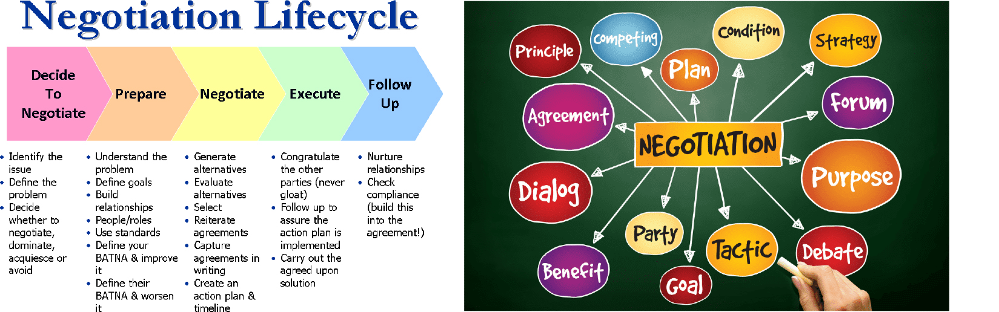

# Guidance_Mantras
A simple page for providing a guidance for all parents, kids and adults in India

# Please read this webpage before taking any decisions in your life. This is my sincere request to everyone to spend 30 minutes to read this webpage. 

A simple repo for providing guidances for all the kids, adults and parents in India

```diff
- text in red
+ text in green
! text in orange
# text in gray
@@ text in purple (and bold)@@
```
### To-Do
- Correct all the hyper link problems, ---->Start from kids
- Add missing content of topics
- Add images to few topics
- Translation into Kannada and Hindi
- Check the content once again and make them correct if anything is wrong
- Remove duplicate content
- Create Website
- Share on reddit channels/ twitter /facebook/whatsapp groups
  
# My Thoughts
```diff
- This web page is only for providing my expierence and knowledge to other people. I am not responsible for your any decisions/your any actions in your life based on this web page informations.
- I am not recommending any application for money here as well.
```
###### Please read this page once in a week, please also make your kids to read this page once in a week.
### Please do share this web page with anyone, anybody can benefit from all this informations. 
### Please share this page with other Whatsapp group, especially among parents, teachers, students and other groups
###### I will update this web page whenever I have new information/missing content is found and content is outdated. The content will also be optimized topic wise.

### When my father used to say all these things, I used to call my father mad. Now I relaize the importance of his works everyday. Therefore, never ever neglect elders suggestions and thoughts

# Table of Content 
###### (Click on the blue color, which takes you the topic information)
1.  [Life](#life)
    1. [Life 1](#life-1)
    2. [Life 2](#life-2)
    3. [Life 3](#life-3)
    4. [Life 4](#life-4)
    5. [Life Plan And Goal](#life-plan-and-goal)
    6. [Family](#family)
    7. [Friends](#friends)
    8. [Social life](#social-life)
    9. [Discipline and Persistance](#discipline-and-persistance)
    10. [Social Media](#social-media)
    11. [Environment](#environment)
    12. [Minimalistic](#minimalistic)
    13. [Planning](#planning)
    14. [Networking](#networking)
    15. [Do It Yourself](#do-it-yourself)
    16. [Chain of effects in life](#chain-of-effects-in-life)
    17. [Responsibilities](#responsibilities)
    18. [Problems](#problems)
    19. [Decision Making](#decision-making)
    20. [Patience](#patience)
    21. [Critical-Analytical-logical-thinking and reasoning](#critical-analytical-logical-thinking-and-reasoning)
    22. [Build a daily routine](#build-a-daily-routine)
    23. [Internet](#internet)
    24. [Documentation](#documentation)
    25. [Self Management](#self-management)
    26. [Build Good Habits](#build-good-habits)
    27. [Fitness](#fitness)
    28. [Spirituality](#spirituality)
    29. [Open Communications](#open-communications)
    30. [Problem-solving](#problem-solving)
    31. [Knowledge Sharing](#knowledge-sharing)
    32. [Future](#future)
    33. [Emotions](#emotions)
    34. [Following](#following)
    35. [Inferiority Superiority Complex](#inferiority-superiority-complex)
    36. [Comparison](#comparison)
    37. [Doing nothing](#doing-nothing)
    38. [Solution Findings](#solution-findings)
    39. [Life Complexity](#life-complexity)
    40. [People](#people)
    41. [Each year](#each-year)
    42. [Materialistic Life](#materialistic-life)
    43. [Saying Yes or No](#saying-yes-or-no)
    44. [Template](#template)
    45. [Bias](#bias)
    46. [Hope Focus SelfControl Confidence and Thoughts](#hope-focus-selfcontrol-confidence-and-thoughts)
    47. [Build Good thinking and Good Thoughts](#build-good-thinking-and-good-thoughts)
    48. [Build Good Routine](#build-good-routine)
    49. [Brain](#brain)
    50. [Experience and Exposure](#experience-and-exposure)
    51. [Learning from others](#learning-from-others)
    52. [Happiness](#happiness)
    53. [Red Flags](#red-flags)
    54. [Followers](#followers)
    55. [Manipulators](#manipulators)
    56. [Provokers](#provokers)
    57. [Influencers](#influencers)
    58. [Jealousy](#jealousy)
    59. [Controlling](#controlling)
    60. [Rest And Mindfulness](#rest-and-mindfulness)
    61. [Personal Development](#personal-development)
    62. [Cunning And Liar](#cunning-and-liar)
    63. [Helping Others](#helping-others)
    64. [Self Reflection And Self Improvement](#self-reflection-and-self-improvement)
    65. [Anger Management](#anger-management)
    66. [Calmness](#calmness)
    67. [Life Boundaries](#life-boundaries)
    68. [Strength And Weakness](#strength-and-weakness)
    69. [Mentor](#mentor)
    70. [Ignore And Adapt](#ignore-and-adapt)
    71. [Two Face](#two-face)
    73. [Doing Things](#doing-things)
    74. [Selfishness and Unselfishness](#selfishness-and-unselfishness)
    75. [Basic Civil Criminal And Labor Law](#basic-civil-criminal-and-labor-law)
    76. [Argument](#argument)
    77. [Negotiations](#negotiations)
    78. [Compromise](#compromise)
    79. [Egoisstic And Saddistic](#egoissitc-and-saddistic)
    80. [Life Phase](#life-phase)
    81. [Genius And Dumb](#genius-and-dumb)
    82. [Selective](#selective)
    83. [Think Analyze Plan and Act](#think-analyze-plan-and-act)
    84. [Plan And Act](#plan-and-act)
    85. [Purpose In Life](#purpose-in-life)
    86. [Fear Mongers](#fear-mongers)
    87. [Insurance](#insurance)
    88. [Shortcuts](#shortcuts)
    89. [Two Mentality](#two-mentality)
    90. [Words](#words)
    91. [Reaction](#reaction)
    92. [Asking And Questioning](#asking-and-questioning)
    93. [Make A Peace ](#make-a-peace)
    94. [Worrying](#worrying)
    95. [Rush And Hurry](#rush-and-hurry)
    96. [Giving Back To Society](#giving-back-to-society)
    97. [Collaboration](#collaboration)
    98. [Accountability And Responsibility](#accountability-and-responsibility)
    99. [Cooking](#cooking)
    100. [5M](#5m)
    101. [Process](#process)
    102. [Learning By Observing](#learning-by-observing)
    103. [Gratitude](#gratitude)
    104. [Life Goal](#life-goal)
    105. [Personal Development](#personal-development)
    106. [Information Gathering And Knowledge Acquiring](#information-gathering-and-knowledge-acquiring)
    107. [Work And Task Split](#work-and-task-split)
    108. [Self Awareness And Self Consciousness](#self-awareness-and-self-consciousness)
    109. [Emotional Intelligence](#emotional-intelligence)
    110. [Listening](#listening)
    111. [Blaming And Responsibility](#blaming-and-responsibility)
    112. [Good And Bad](#good-and-bad)
    113. [Legs on Two Boats](#legs-on-two-boats)
    114. [Organisation Leadership And People Management Skills](#Organisation-leadership-and-people-management-skills)
    115. [Mentoring Others](#mentoring-others)
    116. [Preparation](#preparation)
    117. [Reading](#reading)
    118. [Personal And Professional Goal](#personal-and-professional-goal)
    119. [Positive And Negative](#positive-and-negative)
    120. [Jai Shri Ram](#jai-shri-ram)
    121. [Thick Skin](#think-skin)
    122. [Strong Backup And Strong Backbone](#strong-backup-and-strongbone)
    123. [Small Talk](#small-talk)
    124. [Stop Oversharing](#stop-oversharing)
    125. [Pretend](#pretend)
    126. [Show Off](#show-off)
    127. [Uncertainity In Life](#uncertainity-in-life)
    128. [Relationships](#relationships)
    129. [Shaming](#shaming)
    130. [Teasing And Taunting](#teasing-and-taunting)
    131. [Involvement And Participation](#involvement-and-participation)
    132. [Angry And Stress Management](#angry-and-stress-management)
        
2.  [Health](#health) 
    1. [Pyhsical Health](#physical-health)
    2. [Mental Health](#mental-health)
    3. [Yoga and meditation](#yoga-and-meditation)
    4. [Sleeping problems and solutions](#sleeping-problems-and-solutions)
    5. [Health Test](#health-test)
    6. [Influencer](#influencer)
    7. [Insurance](#insurance)
       
3. [Mindset-Mentality and Brain](#mindset-mentality-and-brain)
    1. [Mindset 1](#mindset-1)
    2. [Mindset 2](#mindset-2)
    3. [Mentality](#mentality)
    4. [Brain](#brain)
       
4. [Mind/Manasu and Soul](#mind-/-manasu-and-soul)
5. [Personality-Behaviour and Psychology](#personality-behaviour-and-psychology)
    1. [Personality](#personality)
    2. [Behaviour](#Behaviour)
    3. [Patterns and Psychology](#patterns-and-psychology)
       
6. [Kids](#kids)
   1. [Activities For Kids or Adults](#activities-for-kids-or-adults)
   2. [Being A Father](#being-a-father)
   3. [Being A Mother](#being-a-mother)
      
6. [Education](#education)
    1. [Free Education](#free-education)
    2. [After 10th](#after-10th)
    3. [After PUC](#after-puc)
    4. [After Degree](#after-degree)
    5. [Effective Use of Government schemes and Services](#effective-use-of-government-schemes-and-services)
    6. [Education for Government Jobs](#education-for-government-jobs)
       
7. [Study](#study)
    1. [How to keep your study environment](#how-to-keep-your-study-environment)
    2. [How to study 1](#how-to-study-1)
    3. [How to study 2](#how-to-study-2)
    4. [Shortcuts](#shortcuts)
    5. [Build a daily routine for Exams or Study](#build-a-daily-routine-for-exams-or-study)
    6. [How to learn english](#how-to-learn-english)
    7. [Improve Speaking and your voice](#improve-speaking-and-your-voice)
       
8. [Jobs](#Jobs) 
   1. [How-to-decide-which-Job-either-Government-or-Private](#how-to-decide-which-job-either-government-or-private)
   2. [Government Jobs](#government-jobs)
   3. [Government Exams](#government-exams)
   4. [Benefits of Government jobs](#benefits-of-government-jobs)
   5. [Website for government jobs](#website-for-government-jobs)
   6. [Books for Government exams](#books-for-government-exams)
   7. [Private Jobs](#private-jobs)
   8. [Skills](#skills)
      
9. [Financial Management](#financial-management)
   1. [Finance 1](#finance-1)
   2. [Finance 2](#finance-2)
   3. [Purpose Of Money](#purpose-of-money)
   4. [Monetisation](#monetisation)
   5. [Earning](#earning)
   6. [Money Handling](#money-handling)
   7. [Agreements And Contracts](#agreements-and-contracts)
   8. [Budgeting](#budgeting)
   9. [Investment](#investment)
   10. [Money Saving Tips](#money-saving-tips)
   11. [Buying Things](#buying-things)
   12. [Payment](#payment)
   13. [Loans](#loans)
   14. [Lending](#lending)
   15. [Financial Goal](#financial-goal)
   16. [Making Money](#making-money)
    
10. [Profession](#profession)
    
12. [Economy](#economy)
    
13. [Technologies](#technologies)
    1. [Programming](#programming)
    2. [Data Base](#data-base)
    3. [Artificial Intelligence](#artificial-intelligence)
    4. [Cloud](#cloud)
    5. [Embedded](#embedded)
       
14. [Others 1](#others-1)
    1. [Travelling](#travelling)
    2. [Power of Music](#power-of-music)
    3. [Electronics](#electronics)
    4. [Addictions](#addictions)
    5. [Mood swing](#mood-swing)
    6. [Important Applications](#important-applications)
    7. [Thoughts and problems](#thoughts-and-problems)
    8. [Agreements and Contracts](#agreements-and-contracts)
    9. [Boys And Men](#boys-and-men)
    10. [Girls And Women](#girls-and-women)
    11. [Sex Appeal](#sex-appeal)
       
 15. [Others 2](#others-2)
     1. [Studying in abroad](#studying-in-abroad)
     2. [Reading](#reading)
     3. [Ethics](#ethics)
     4. [New Place or New Place Of Work](#new-place-or-new-place-of-work)
     5. [For boys and Gents for above 15 years old](#for-boys-and-gents-for-above-15-years-old)
     6. [Behaviour with girls and women for above 15 years old](#behaviour-with-girls-and-women-for-above-15-years-old)
     7. [Cloud Future](#cloud)
     8. [Women](#women)
     9. [Dear Son](#dear-son)
     10. [Dear Daughter](#dear-daughter)
     11. [Men](#men)
    
16. [Business](#business)
    1. [Business_Stratergy](#business-stratergy)
       
## Life 

### Life 1
- Life is not too short, You will have life until 70/80 years, sometimes until 90 years.
- Always learn from other people
- Always learn from your mistakes
- First know the world and how it works
- One should know how to use mobile phones and different applications
- One should know how to use laptop, if possible, have at-least one laptop at home
- Google Laptop under "30,000 rs" or check with nearest good laptop dealers
- If laptop is not possible, have a tab at-least like this one https://www.amazon.in/dp/B096SB842B?psc=1&ref_=cm_sw_r_apin_ct_H8SBRVBX6PX85FW5P1KB&language=en_US
- One should know the useful legal laws such as criminal law/labour law/business law and civil law
- One should know how to drive Bike/Car, have driving license
- Learn to speak slowly
- Do not argue about religion and caste, on unwanted things
- Education does not teach everything in life
- As many indians always think that grass is greener on the other side, that is not true
- Each person has its own life and individuality always
- Keep in mind, younger generation will have the advantages in their life always as compared to you
- Kids born in 2000s have more advantages than kids born in 1990s in terms of money, life, technology, information, education
- There will be some turbalence/problems in life, one has to lear how to move on/live with  them
- Never be emotional in life, emotions kills you and ruin your life
  
### Life 2
- Do not follow any Actress and actors, you have no benefits from them
- One should know how to use Youtube and Google to gain knowledge and usefule information
- Do not get into any business/things without having a basic knowlegde
- Mind your business in life
- Always listen when experieced/ elder people are telling something good
- Think and make the decisions for long term benefits always
- One should learn about how to be selective in life/ on social media such as Facebook/instagram/so on.
- Know the consequences of  your each actions in your life always
- Be aware of provokers in life
- Be aware that if something goes wrong in life, it would be very difficult to fix/get back to post incident. Therefore, be careful about your actions and decision in your life always.
- Read/listen to Bhagavad gita, which teaches about process
- Learn to Adapt, ignore, listen, control youself, compromise
- Have a mentor in life and for your kids always
- No body knows everything in life, so people learn as they grow
- Do not try to experiece/have everything in life, it is better not to experience/have some things in life
- Do not be bother/worried about news, basically stop watching news until you are 25 years old and even after if possible
- Not all people are good on earth, similarly, not all people are bad.
- World is not fair for everyone, it does not mean that world will be bad for you. Always try for better in life irrespective of anything
- Never ever put legs on two boats in life or in profession

### Life 3
- Understand what the life is first, before begin
- Money only does not bring/give you everything in life
- Never ever make life complicated, always try to make life easier everyday
- Learn to know what is needed for you and what is not needed for you in life
- Negative things/people/thoughts/actions attracts more than positive things/people/thoughts/actions, so always move towards positive things is very difficult.
- One should know that what should be studied for what you want to became in life
- One should know that What will happen if you do something
- Never be emotional in life, emotions kills you and ruin your life

### Life_4
- Negative/bad things attractive us very fast than positive things
- Bad/wrong things spread very fast than good things
- For people, far hill/mountain appears good, but in reality, far hills/mountain is empty.
- For people, other side always appears good than their side in life
  
### Family
- Family is everything in life such as parents, sisters, brothers, good relatives
- Build a bond with everyone as much as possible
  
### Friends
- Always be with good friends
- Learn good things from other friends
- Your future life and your behaviour depends on your friends and people around you. 

### Life Plan And Goal
- Will be added later
  
### Social life
- you should know the value of social life
- Social life helps you to know the value of relationships, trust, value of life
- Please engage with people everyday
- You can learn new things from other people

### Discipline and Persistance
- Drink One glass of water(hot/cold) after wake up everyday, which defines the discipline

### Social Media
- Be selective on social media such as facebook/instagram
- You can block unnecessary things, such as post/groups/people/videos on any social media
- Keep you social media clean
- Your social media feed works on what you follow, what you watch more, what you like. Basically, it i based on AI recommendation system
- Delete unwanted emails, block unwanted emails and  unsubscribe unwanted emails
- Avoid social media as much as possible, easy to say, but can be done.
- Learn/teach how to use Google and youtube to gain knowledge about different topics

### Environment 
- Our behaviour depends on our surrounding environment
- So kids should grow in good environment. 
- Stay away from negative people
- Watching bad videos make you think and act bad
- Being with bad people make you become bad person
- Being in bad environment, make you become a bad person
- Seeing/watching bad things, make you do bad things
- Having bad soul/mind/manasu, make you bad person

### Minimalistic
- The meaning of minimalistic is to having only needed things in life
- Minimalistic says that "One should buy only needed/essential things in life"
- An example for minimalistic is to having a car worth of 10 Lakhs for your use and for your family. Minimalistic does not say to buy a car worth of 1 Crore for your family use, when you are earning a 10 lakhs per year.
  
### Networking
- Please be connected with likely minded people everyday always
- Networking gives you more knowledge than anything and sometimes help as well
  
### Planning
- Plan everything in your life, such as getting Jobs, going out or doing something, eventually it reduce the burden and save time
- Always plan in your life for next 5 to 10 years ahead
  
### Buying things
- You should know the use case of each item, which you need to buy and actual cost of it
- Before buying anything, please check whether the price make sense or not,
- Before buying look into different websites/shops to compare prices

### Do It Yourself
- One should know/learn how to do your works by yourself, at-least simple things

### Problems
- World problems are not your problems, keep in mind
- Your problems are only your problems, keep in mind
- Always get to know the root cause of your problems to find the solutions for your problems
  
### Responsibilities
- You should know your responsibilites/obligation in your life first such as financial, job, home and parents
- Take care of your finance for your future and your family future
- Your life your responsibility
  
### Dealing with people
- Not all the people on earth are good, similarly, not all the people are bad
- You should know how to distinguish between good and bad people
- People use mind-game  to manipulate others, so be aware of it
- Always stay away from any financial things with other people/strangers
- People will be nice when taking money from you, afterwards, people behave strangely.
- Learn to interpret a person via his/her personalities, his/her talking, from his/her past if possible, his/her motive
- Stay away from person if you feel that a person is not good for you.
- Learn to be gentlemen and nice, when you need something from someone or want some work from someone
- Never ever thinks that their ass is better than your ass
- Follow the rule: Be with everyone, trust no one in life
- Parents, Siblings and relative, friends are also people
- Learn to deal with Parents, Siblings, relatives, friends
- Learn to deal with people with different personalities  and behaviour such as Rude, Negative, difficult, soft and hard
- Learn to deal with people at work
- Do not trsut anyone, but be with everyone
- Keep the reltionships and money separate
- If relationships need free money, stay away from those kind of relationships
- Never ever do any kind of business or money transaction with anyone without any security documents or collateral 
  
### Chain of effects in life
- will be added with diagram

### Each year
- Always have a target/goal for next year in life/professional life
- Always have a financial target for next few years in life

### Materialistic Life
- Do not be a materialistic person, which means buying everything which you see
- Some people buy 1 phone every year and change car every 2 years.
- In life, a person need one phone, one laptop, one car or one house to live
- You can buy assests, not liabilities such as laptop, car, phone every year
- Assests are biggest investment than liabilities

### Saying Yes or No
- People should know when to say "YES" or "NO" for someone requests
- When relatives/friends/strangers request something/somework, first always give some time to react/commit to any request
- When colleagues request something/somework, first always give some time to react/commit to any request
  * Think your capabilities first
  * Think about your time and efforts, health, finance
  * think about consequences
- Take always more time to react

### Following
- Will be added later

### Inferiority Superiority Complex
###### Inferiority Complex

###### Superiority Complex
- Most of the time in our life, we need to come out of mindset that other person is superior to you in terms of knowledge, wealth, intelligence and power
- But, sometimes, we need to ack dumb infront of knowledgeable, intellgient, wealthy people
- 

### Comparison
- Will be added later


### Hope Focus SelfControl Confidence and Thoughts
- Man needs hope, focus, control himself, confidence to face the life and problems,
- Man needs to control negative thoughts and have positive thoughts and strong mind
- Most people and big leaders in the world use chant slogans when they need hope, self-control, positive thoughts, confidence in life
- People use chant as  "Jai Shri Ram, Jai Jai Shri Ram" and "Om Namah Shivaya", "Om Shanthi, Om Shanthi" and " All is Well", "I can, I can"
- 

### Followers
- Basically followers mean, anyone in the family or friends circle or professional circle
- For an example, if you wake up at 8:00 AM, your wife or son or other people wake up at 8:00, even though they have work, you do not have work
- So they follow your behaviour patterns, routines
- If you watch more phone/use more phone, they also does the same thing
- Therefore, keep an eye on your behaviour, daily routines, personalities and talk
  
### Decision Making
- if you want to make any decision in your life please follow below approach
- Do not allow your emotions to influence your decisions
- Go out for a walk and free your mind first
- Learn to take decision based on data and informations
- never ever take any decisions in urgent
- never ever take any decisions when you are happy/sad
- while walking think about pros and cons of your decision and write them down in mobile/sticky notes
- talk to someone( family member/friends/stranger) about your thoughts process for your decision 
- write down your thoughts and pros and cons of your decisions process
- Get more information about your decisions 
- Do proper research once again
- Do not consider grass is greener on other side always, while taking decision
- revisit your thoughts before finally agreeing with it

### Happiness
- Will be added later
- 
  
### Helping Others
- Will be added later

### Self Reflection And Self Improvement
- Will be added later
- 
  
### Anger Management
- Will be added later
- 
        
### Patience
- Please teach your kids to have a patience in their life through yoga, meditation, sports
- Patience helps kids/anyone to think logically during difficults times and help to take proper decisions
- Patience helps to navigate difficult situations in life and dealing with other people in life

### Template
- Always remember template helps you to learn something very fast / do something very fast
- In life, everything is in the format of template. Template is basically blueprint which will be  in certain oder to learn something or do something
- Many people use template to build something very fast, such as educational institutions, building, business or learning something
- In template, you identitfy the common pattern across very things, such as learning something or doing something
- For an example, Using template concept

### Bias
- Will be added later
  
### Critical-Analytical-logical-thinking and reasoning
- Learn/teach yourself/your kids to develop critical thinking, so that life become easier
- 
### Build a daily routine
- Wake up at 6:00/6:30
- Get fresh and drink glass of water
- Go to work,
- come back to work and going for jogging /walking/gym
- Do yoga and meditation at home

### Internet
- Know what is internet and it advantages in life

### Documentation
- Learn the importance of documentation in life such as storing each and every bill you paid upto some time
- Documenting your learning/knowledge gainings
- Learn how to keep each and every documents until the end
- Learn to sort the documents.
- Keep a different document holder for each topics such as Family, Finance, Health and so on

### Self Management
- Will be added later
- 

### Build Good Habits
- Added photo
- Will be added later
- 
  
### Fitnes
- Will be added later and add photo

### Open Communications
- Will be added later

### Problem Solving
- Will be added later
  
### Knowledge Sharing
- Whatever you learn, always build the habits of sharing
- Always share your knowledge with others such as brothers, sisters, relatives and friends
- Sometimes, even with strangers

### Emotions
- Emotions ruin your life and your finance
- Never be emotional in life
- 
### Future
- Learn to think for future
- Learn to fit for future
- Learn to save for future
- Learn to work for future
- Learn to guide for future
- Learn to grow for future
- Learn to learn for future
- Learn to eat good for future
- Learn to exercise for future
- Learn to build for future
- Learn to Analyze for future

### Doing nothing
- Sometimes in life, it is better not to do anything
- Everyday, just sit for 1 hour without doing anything
- Sit/do nothing for 5-10 minutes while working for 1 or 1:30 hour work
- On saturday and sunday focus on your life, family, personal development, your finance or your goal always no other people work
- On holidays, just focus on your life and enjoyment, no other thinking or other people work
- After 5 or 6 in the evening, until 6/7 in the morning, no to work or no to other people work or no to other people in your personal life/professional life

### Solution Findings
- Always remember, there will be solution to any problem in life
- You need patience to think and find the solution for your problem
- Learn to find the solution for each and every problem in your life via patience
- Always get to know the root cause of your problems to find the solutions for your problems
  
### Life Complexity
- Learn how to make life easier, not complex every day
- Learn from others how to lead easy life

### People
- Not all the people on earth are rich or poor , some maybe middle class or maybe ultra rich
- Not all the people on earth are earning same money or good money
- Not all the people on earth are good in studies, or finance or stratergy or thinking analytically or critically
- Not all the people on earth are good in behaviour or mental health
- Not all the people on earth are good in health
- Not all the people on earth are good in family
- Not all the people on earth are good with everyone
- Not all the people on earth are good in society
- Not all the people on earth are good in everything

### Build Good thinking and Good Thoughts
- Will be added later
  
### Build Good Routine
- Will be added later

### Brain
- Train your brain for everything each day
- Brain is like a stomach and Muscle
- If you eat good food, your stomach will be good, if you eat bad food, your stomach will be bad
- Similarly, feed good information into your brain, your brain works well
- Train your brain with good information each day
- Train your kids as well
- 

### Experience and Exposure
- Will be added later

### Learning from others
- Will be added later

### Red Flags
- Will be added later

### Manipulators
- People will manipulate you to do tasks or obey their orders
- Based on your mentality, you decided to do the task or obey their orders
- For an example, my friend used to manipulate me to drink alcohol when I told him about my sleeping problem
- My friend tells me to drink alcohol to get better sleep, fortunately, due to my tough mentality, I ignored him
  
### Provokers
- Will be added later

### Influencers
- Will be added later

### Jealousy And Angry
- Will be added later

### Controlling
- Will be added later
- 
  
### Rest And Mindfulness
- Will be added later
- 
  
### Personal Development
- Will be added later

### Two Faces
- Will be added later
  
### Cunning and Liar
- Will be added later


### Shortcuts
- Will be added later
  
### Doing Things
  - Will be added later
    
### Selfishness and Unselfishness
- Will be added later
  
### Basic Civil and Criminal Law
- Will be added later
  
### Negotiations
- Will be added later
- 
- 
- 
  
### Compromise
- Will be added later
  
### Egoisstic And Saddistic
- Will be added later
  
### Life Phase
- Kids
- Students
- Adults with degree
- Adults with Job
- Marriage
- Married with Kids

### Genius And Dumb
########## Genius
-

########## Dumb
-

### Selective
- Will be added later

### Think Analyze Plan and Act
- Will be added later
  
### Plan And Act
- Will be added later
  
### Purpose In Life
- Will be added later
  
### Fear Mongers
- Will be added later
  
### Insurance
- Will be added later
  
### Two Mentality
- Will be added later
  
### Words
- Will be added later
  
### Reaction
- Will be added later
  
### Asking And Questioning
- Will be added later
  
### Make A Peace 
- Will be added later
  
### Worrying
- Will be added later
  
### Rush And Hurry
- Will be added later
  
### Giving Back To Society
- Will be added later
  
### Collaboration
- Will be added later
  
### Accountability And Responsibility
- Will be added later
  
### Cooking
- Will be added later
  
### 5M
- Will be added later
- 
    
### Process
- Will be added later
  
### Learning By Observing
- Will be added later
  
### Gratitude
- Will be added later
  
### Life Goal
- Will be added later
  
### Development
- Will be added later
  
### Information Gathering
- Will be added later
  
### Work And Task Split
- Will be added later
  
### Self Awareness And Self Consciousness
- Will be added later
- 
  
### Emotional Intelligence
- Will be added later
  
### Listening
- Will be added later
- 
  
### Blaming And Responsibility
- Will be added later
  
### Good And Bad
- Will be added later
  
### Legs on Two Boats
- Will be added later

### Organisation Leadership And People Management Skills
- Will be added later
  
### Mentoring Others
- Will be added later
  
### Preparation
- Will be added later
  
### Reading
- Will be added later
  
### Personal And Professional Goal
- Will be added later
  
### Jai Shri Ram
- Will be added later
- 

### Positive And Negative
- Will be added later
  
### Thick Skin
- Will be added later
  
### Strong Backup And Strong Backbone
- Will be added later
  
### Small Talk
- Learn how to start small talk
- Small talk helps in building relationships, starting a relationships
- Small talk helps in resolving conflicts, problem sloving, understanding other people
- Small talk helps in getting information, gaining knowledge
- Small talk helps in advising others, suggesting something
  
## Stop Oversharing
- Will be added later
  
### Pretend
- Will be added later
  
### Show Off
- Will be added later

### Uncertainity In Life
- Will be added later
  
## Mind-Manasu and Soul
- Keep your mind pure and negative free
- Mind/Manasu helps you in your thoughts either positive/negative
- Manasu always should be pure
- Read about manasu/mind here https://www.quora.com/What-do-we-call-Manasu-in-English
- Mind/Manasu control your thoughts
- Sould should always be pure and free of negative thoughts

## Personality-Behaviour and Psychology

### Personality
- Teach/Learn yourself/your kids how to respect girls and women
- Teach/learn how to handle the urges for yourself/kids
- Learn/Teach about eating habits for yourself/kids
- Learn/teach not be feel inferior to other person in terms of knowledge/studies/money for yourself/kids
- Learn/teach how to be confident for yourself/kids
- Learn/teach how to be slient for yourself/kids, instead of talking always
- Learn/teach how to take accountability in life for yourself/kids
- Learn/teach about critical thinking, analytical thinking and logical reasoning for yourself/kids
- Parents have to leave ego for the sake of kids
- Learn/Teach/Develop self-consciousness for yourself /teach your kids. This is important one
- Learn/Teach self-management for yourself/for your kids
- Self-management, self-control, self-love defines your personalities and character when nobody is there to watch/look-out in your life.
- Keep your ego aside in life when you need to be better person, ego make your life hell.
- Do not carry over ego or fight with anyone
- Never be in a slave mentality
- Being a good person does not help always in personal and professional life
- Bad attitude, bad mindset, bad friends circle, bad mentors, bad thinking make you bad in life
  
### Behaviour
- Less talk, more listen
- Less talk leads to more thinking and good decision making
  
### Patterns and Psychology
- Patterns defines the your cyclic behavior based on your actions, let's say you drink water everyday in empty stomach, this is a patterns of having heath concern. 
- Patterns basically shows how is your behavior based on your actions, such as doing wrong things shows pattern of not trust worthy, lying shows pattern of dishonesty. 
- Understanding of Psychology gives you better understanding of other person, world and understanding of yourself

## Health 
- Drink one glass of water after your tooth brush in the morning
- Rinse your eyes(Hold the water in your both hands and open your eyes in the water) in the morning and evening everyday
  
### Physical Health
- Always eat fruits, vegetables instead of junk food
- Do physical activites everyday for at-least 1 hour such as walking, jogging, playing sports, going to gym or work-outs at home
- you can do work-outs at home with simple tools like below picture. dumbbells and yoga carpet
- 
  
### Mental Health
- You should learn to keep good mental health
- Please do yoga and meditation for at-least 30 mintues a day, 20 minutes for yoga and 10 minutes for meditation
- Yoga and meditation improves your mental health
- Yoga and meditation improves focus, concentration
- Yoga and mediation improves decision making skills and thinking ability
- Yoga and mediation improves your patience level
- If you have problem to sleep, please do physical activities such as running, work out in the evening for 1 hour
- Please do not think about anything before two hour of sleeping
- If you have problem, please share with someone close to you such as brother, sister, parents, friends, it will relieve your mind
- please do yoga and meditation in the evening between 5 pm and 8 pm in a open room
- For yoga and meditation, you can take coaching for thr first time for 3 months in-person/online

### Yoga and meditation
- Do some small exercies for 10 minutes before doing meditation for 10 minutes
- While breathing out during meditation, chant Omkara like this https://www.youtube.com/watch?v=_47wSw0gFX0
- Purpose of doing meditation is to exercise your brain and stay away from distraction and keep your mind empty

### Sleeping problems and solutions
- Nearly 80% of adults/kids have sleeping problems
- Best way to get proper sleep is to punish your body and mind through work-outs at home, going to gym, going to jogging, doing sports such as cricket, badmiton everyday for 1 or 2 hours
- Do yoga and meditation for 30 mins in the evening before dinner
- Do not use phone one hour before going to sleep, avoid watching TV/using laptop one hour before bed
- Never ever drink tea or coffee of any kind, 4-5 hours before bed
- Avoid drinking lots of water after dinner, just one small cup(250ml/300ml) is enough.
- Keep phone is slient mode at night
- Get good bath with hot water on shoulders and on back body before dinner in the evening
- Maintain proper sleeping cycle at night. for an example, from 9:30 pm to 6:00 AM
- Never ever sleep more than 30 minutes during day time
- use noise cancelling headphone to avoid disturbance at night like below. SoundCore earbuds https://www.amazon.in/Soundcore-Earphones-Bluetooth-Compatible-Waterproof/dp/B099K5YT5V
- 

### Health Test
- Get eye test every year, either free or for paid one
- Get full blood check up every year,  either free or for paid one
- Get full body check up every year, either free or for paid one
- Get all Vitamin tests every year
  - 
    
### Influencer
- People will always get influenced by other people
- People such as our parents, our kids, our friends and our sisters and our bothers 
- Our relatives will be influenced by influencers for smoking, drinking alcohol, for having girl friend/boy friend
- for buying expensive things such as expensive phones, expensive cars, expensive dress and so on

### Spirituality 
- https://open.spotify.com/artist/5yMmIhZ6dUYvVjjqzFOOzN?si=8ywHDk8vTk6TPY31e2yn0w
- 
### Insurance
- Always have a health insurance in life for everything

## Kids

### How to raise Kids
- Never ever reveal your wealth to kids until 20 years old
- Always make sure that kids get only basic things in life, instead of buying expensive things
- Kids should only know that they have their own home and that would be enough
- Each kid should have his/her own room after 13 years old/8th standard
- Kids follow what others do and say, so do good things to make kids to follow you
- Make sure to teach kids to fix their mentality to study until 25-26 years age. Not just 10th, 12th Class or degree.
- Talk to kids each day about their day, study, sports, mind, mental and physical health, friends circle for at-least 30 minutes
- Train kids to physically and mentally fit each day.
- Be a part of kids, when they are studying at home at-least until 18/19 years old.
- When kids become youger, ask them about goal, ask them about their financial management, financial situation
- Train kids for each and everything things in life such as,
    1. Education
    2. Exam
    3. Study
    4. Competative exams
    5. Mentality
    6. Money and Time Management
    7. Angry And Stress Management
    8. Behaviour
    9. Personality
    10. Speaking
    11. Patience
    12. Dealing with People
    13. Health
    14. Friends circle
    15. Good Habits
    16. Emotional intelligence
    17. Physical and Mental Fitness

  - Teach/train kids not to react to anything very fast whatever in life
  - 

### Activities For Kids or Adults
- Music class, dance class, drawing
- Swimming
- cricket/badmiton/running
- Gym/workout
- Learning new language English, Hindi
- Make sure that your kids listen to Hindu Mantras for 5-10 minutes, for an example like this one https://open.spotify.com/playlist/4DrHUz8VRzlKlLG5qut0Cz?si=e3b6e904dd6a4e9d
- Allow/Teach kids to think about their actions/thoughts everyday for one hour, which allows for reasoning, logical and critical thinking ability.
- Kids should sleep enough for at-least 8-9 hours per day on weekdays, on weekends/holidays in the afternoon as well.
- Teach kids not to follow any actors and actress, you have no benefits from them
  
## Financial management
### Finance 1
- Never be emotional in money matters with anyone such as parents, patners, friends, stangers, relatives, siblings and so on
- Rule of thumb: Never pay full amount of anything such as buying, schools/college/universities fees and so on.
- Please teach your kids the value of money, which means how the money should be spent
- Please teach your kids how to track expenses in their life
- Never ever buy/give everything for your kids, so that you should make them to learn/know the importance of being not having something/everything in their life.
- One can earn money at any age, but not health, education or relationships
- Learn what is inflation and how it affects your life and savings?
- Learn about Capitalism and investment
- What is economy?

### Finance 2
- One should know the different between business, friendship without money, relationship without money, relative without money, colleagues without money
- Use application to track your spending and earnings https://goodbudget.com/ for free
- Write down your earning, expenses, given money, received money in a dairy every day
- Spend at-least half a day to check your finance every week.
- Never ever lend/give money to anyone without proper agreements/contracts signed by both lender and receiver
- Never ever trust anyone in money matter, not even friends, relatives, cousins and so on. 
- Always remember money is not everything either for personal or professional life
- Spend at-least 2/3 hours every week on sundays to manage your finance, such as spending, earning and others things
- Keep all the spending and earning bills for at-least 2 years
- Keep a dairy for Money management, write down everything in it!
- Check your bank statements or any other applications every week

### Earning
- Earning money is part of life, but you should know why you are earning money
- You are earning money for good life, to pay rent or to build own house or to build own business
- You are earning money to buy land or lend to someone
  
### Money Handling
- Be conditional with money, money comes first over friendships, relationships, professionalism and whatever it is.
- How money works
- Learn to handle money from small at 1 Rs to big 1 cr and more
- Learn to handle money in tough and easy situation
- It is your responsibility to save you money, not others, always remember
- One has to be very strict and conditional with money
- Stop spending like there is no tomorrow
- Learn to play with money safely and focus on doubling it
- Keep the reltionships and money separate
- If relationships need free money, stay away from those kind of relationships
- Never ever do any kind of business or money transaction with anyone without any security documents or collateral


### Budgeting
- Will be added later
- 
### Investment
- Passive income
- Stocks(If you have basic knowledge)
- Mutual funds
- Pension funds
- Commercial properties
- Commercial buildings
- Land(Agriculture/residentail land)
- Gold
- Fixed Deposit in Banks
- Always start from 10rs-->100rs--->1000rs---->10,000rs----->1,00,000rs---->10,00,000rs---->1cr-->so on
  
### Money Saving Tips
- Will be added later
- Never ever pay for anything in full amount, always go for EMI options with less interest or no interest

### Buying Things
- Take at-least 2 or three weeks to buy anything
- As soon as someone tells you to buy something, always ask for time
- If you think that you need something/buy something, always takes at-least 2-3 weeks
- How to think and analyze before buying anything
  * First think what is the use case of buying something
  * then think whether you can afford or not
  * then think whether you need it now or later
  * then think whether you need an used one or new one
  * then think best possible way to afford it either through EMI or late payment
  * Never pay full amount to any buying in life
  * Analyze above points once again before making a decision to buy something/anything
- Always go for second hand buy as a first option on different application such as olx, ebay , amazon or others
- Always buy either new or second hand in festival season or offer season such as Diwali, black friday, big billion day, or christmas offer or so on
- Always look for areas in your cities, where things will be cheaper
- In Bengaluru, people get cheap products in different areas like below
- JC Road in Bengaluru: cheap car and bicycle parts, cheap laptop, mobile and parts, cheap electronics parts 
- SP road in Bengaluru : cheap second hand books and new ones
- Chikkpete in Bengaluru: cheap clothes
- Shriram pura and cubbonpete in Bengaluru : branded clothes for less money
  
### Payment
- Never pay full amount to any buying such as electronics(phone, laptop, cars and so on), clothes,
- Never pay full amount to anyone such as schools, colleges or universities or so on
- Never pay full amount to anyone when asked.
- Always go for EMI options or last payment options or monthly payment options
 
### Loans
- If loans are needed, always look for minimum interest options with more flexibilities such as varibale payment instead fixed payment

### Lending
- Never lend money to anyone such as relatives, friends, strangers and colleagues without any document or collateral


### Making Money
- Making money is a skills
- Making money needs efforts and money as well
- Making money needs your time or your money or some times both money and time

### Agreements And Contracts
- Always focus on having an agreements/contracts as per your wishes or on your side, in case of disputes, you can have upper hand in court
- Never ever sign any agreements/contracts without checking with two or three lawyers
- Always take lawyer suggestions before signing any agreements or contracts

## Study

### How to keep your study environment
- Always have a plan for your studies every day 
- Always study for one/ one and half hour and take 10 minutes break/ go for a small walk outside/on top of your house/outside your house
- Do not study in dark room
- Join study group for preparing for competitive exams on facebook, reddit, whatsapp
- get and walk for 5-10 minutes around your room if you feel overwhelmed while studying
- Always study under proper sun light/big room
- Always have a good study table and chair for each person like below
-  .
- Keep your study or personal room clean and tidy, well organised like below
-  

### How to study 1
- Always use template stratergy to learn something fast
- Always study for one or one and half hours continuously and take 10-20 minutes break for walking or going outside or for drinking water/tea
- Make a study time table always and subject wise study table(one/one and half hour for each subject)
- Same for competitive exams based on books/domain/topics
- Or find the best study time table for yourself if needed according to your efforts
- Always study next to windows and keep your study table next to windows/ in a open room with good light and visibility. Not in dark room or not next to TV room or TV

### How to study 2
- Do not memorize anything, understand the concepts and format the concepts in your own words
- Do not memorize mathematics, mathematics needs to be practice with work sheets
- Mark/High lights important things in your text books with highlighters
- Underline important things/sentences/lines in your text books
- Listen music for better focus while studying if needed on Spotify application (https://open.spotify.com/)
- https://open.spotify.com/playlist/1ILN6NiSwe9pmz0u7HJ67y?si=c78e2727799346b8
- You can also listen to music when you are bored/alone
- You can also listen to English/Hindi Podcast here
- Buy headsets like below. SoundCore earbuds https://www.amazon.in/Soundcore-Earphones-Bluetooth-Compatible-Waterproof/dp/B099K5YT5V
- 
- Use sticky notes to make a To-do list and important things like below
-  .
- 

### Build a daily routine for Exams or Study
- This is an example plan, so adjust the plan according to your benefits
- Wake up at 6🕥/6🕡, get fresh, drinke glass of water, clean your room
- Go for small walk and come back study.
- Make a study plan for everything
- Study for 1 hour or 1 and half hour/2 hour, take 5 minutes break
- Take a power nap in the afternoon for 10/20 minutes
- Study for 7-8 hours for competative exams daily
- Go for jogging/guy/walking for outside for one hour
- Do yoga and meditation for 30 minutes/one hour
- My work and study environment is like below:
- 
  
### How to learn english
- Keep a book and start learning english grammer for 30 minutes each day here on youtube    https://youtube.com/playlist?list=PLxSz4mPLHWDYoqVgOxNqjozVcwW5YLTAH&si=Ykj62gWbdFa1joFH or https://www.youtube.com/@engvidRebecca
- Watch each grammmer topic and spend one week on that grammer topic to improve/gain knowledge about the grammer topic
- Write at-least 20-30  different examples on each grammer topic.
- Improve your english writing and keep a book and Write one page about the topic each day. For an example, topics such as Environment, earth, science, technology and so on. First read about the topic on Google/internet and wrtie about the topic in a book
- While writing about the topic, use all kinds of grammer
- After writing, ask english speaking person in your family to check your writing, ask for suggestions/improvements
- Listen to english podcasts on Spotify to improve listening skills. For an example, like this one https://open.spotify.com/show/4NHIIVB3DkjH70yhE3pbcd?si=fcd980155cf047d6
- Read quora/newspaper to improve reading skills. For an example, like this one https://www.quora.com/
- Speak in english often at home or at school/college/office/with friends to improve speaking
- If possible join, english speaking course for 3 months at maximum
  
### Improve Speaking and your voice
- Use Tongue exercises such as like this one https://www.youtube.com/watch?v=HHRNcIPxijY
- Then do tongue twister  ---> https://www.stagemilk.com/articulation-exercises/
- Articulation for tongue: https://www.youtube.com/watch?v=HHRNcIPxijY
- - 

## Mindset-Mentality and Brain

### Mindset 1
- One should have proper mindsets while doing any task and preparing for anything such as exams
- Mindsets play a important role in achieveing tasks/goals or clearing exams
- Positive Mindsets, avoid negative thoughts and mindsets
- Come out of the loop that other person is superior to me in knowledge and studies
- Learn to analyze other Person strength
- Learn how to handle pressure in life
- Learn how to train your brain for anything.
- Basically, brain works similar to your stomach.
- If you eat healthy food, you are healthy, if you eat unhealthy food, you are unhealthy.
- Likewise, if you feed good knowledge and good input data, your brain perform good.
- For bad knowledge and bad input data, your brain perform bad.

### Mindset 2
- You should always give some time in a day at-least 30 minutes to think about your life, your actions, your future goals,
- You should not compare your life with other people
- You have your won strength/individuality, focus on those things
- You should learn to control your emotions/thoughts through mind/manasu
- You should learn to understand things and dealing with other people such as parents, friends
- You should know your responsibilites in your life, your goal always
- Improve your confidence, appearances, way of talking(please do online search for help)
- Come out of the loop that someone will help you/someone is there for you to help always.
- Self control such as your thoughts, actions, mind and body through yoga and meditation or physical activities

### Mentality
- Learn how to be tough minded

### Brain
- Learn how to train your brain
- Learn to control your mind whole day and each day until your achieve something in your life and even after also
  
## Education
- Education is just a part of five essentials in our life such as Air, Food, Water, Clothes
- Learn the importance of education
- Never ever memorize anything, understand the things first and work on them
- Please do not expect your kids to be a topper
- Please always focus that your kids should have basic education such as Bachelor degreee to get a Job/ be eligible for government exams
- Please remember that Education is just one of the essiential part of today's life along with water, Air, clothes and food
- Always know that what happens if you study a specific course/domain, which means the benefits of it in terms of jobs either private/government 
- Never spend too much money on education of kids or yourself
  
### Free Education
- Always try to get good education with low cost through NGOs, Religious schools such as BGS schools and so on
- Try to find cheap and good schools, colleges and universities
- Give exams to free schools/colleges/universities like below
- Sainik Schools Society https://aissee.nta.nic.in/ from 5th standard
- Navodaya from 5th standard
- Private/state funded exams for free education
  
### After 10th
- If you are confident enough to clear Science, then take PCMB for Medicine/Engineering, PCMC only for engineering/BBA/BCA
- You can take commerce/Arts only for government jobs
- Another option is Diploma in Engineering, then take Diploma in Computer Science/Electronics/Electrical/Civil
- For Medical(NEET) and Engineering degree(CET), you need to take CET/NEET coaching so that you might can try for better ranking.

### After PUC
- Bachelor of Science - B.Sc.
- Bachelor of Arts - B.A
- Bachelor of Commerce - B.Com.
- Bachelor of Business Administration - B.B.A.
- Bachelor of Education - B.Ed.
- Bachelor of Laws - L.L.B.
- Bachelor of Physical Education - B.P.Ed.
- Bachelor of Fisheries Science - B.F.Sc./ B.Sc. (Fisheries).
- Bachelor of Forestry
- Bachelor of Science Agriculture - B.Sc.AG
- Bachelor of Horticulture - B.Sc. Horticulture
- Bachelor of Veterinary Science & Animal Husbandry - B.V.Sc. & A.H. / B.V.Sc
- Bachelor of Engineering / Bachelor of Technology - B.E./B.Tech.
- Bachelor of Computer Application (BCA)
- M.B.B.S(Doctor) -----> Need Good rank in KCET/NEET
- B.D.S (Bachelor of Dental Science)
- Eye doctor, Ayurvedic doctor, homeopathy, speech and hearing,
- Defense Academy degrees through NDA

### After Degree 
- Please ask other people if you have no one to guide what to do next so that you will have better understanding of jobs and future studies
- You can also do/get some coaching/certificates to get jobs in Engineering sector after your B.Tech.
- You can join a private company and prepare for government jobs, while working as a teacher/contractual government jobs/group C/Group D government jobs
  
#### The main purpose of doing Post-graduate is to prepare for government exams during Master studies, so that you will get money from Government as a stipend and you will have more time to prepare for good government/private jobs
#### In somecase, people want to become a lecture/professor, teacher, so for most reputed universities and institute, Post Graduate is required

- Master of Science Agriculture - M.Sc.AG
- Master of Arts - M.A.
- Master of Commerce - M.Com.
- Master of Dental Surgery - M.D.S.
- Master of Education - M.Ed.
- Master of Engineering / Master of Technology - M.E./ M.Tech.
- Master of Science - M.Sc.
- Master of Veterinary Science - M.V.Sc.
- Master of computer application(MCA)
- Doctor of Medicine (M.D)
- 

### After PostGraduate
- Ph.D

### Effective Use of Government schemes and Services
- One should know how to use government schemes such as loans, reservation, subsidy, scholarships
- Reservation of SC/ST,  OBC, EWS(Economic Weaker Section in General Category), Women reservation, Rural and kannada medium quota
  
### Education for Government jobs 
- If you are aiming for government jobs, always take dummy 3 years degree such as B.A, B.com, B.Sc general and score above 65%
- Best example is Tina Dabi https://en.wikipedia.org/wiki/Tina_Dabi, she took Arts(Political science) in PUC and B.A. in political science and her major in UPSC was Political science.
- So Tina Dabi studied only political science to clear IAS exam at 21 years old. She was not bright students, but intelligent and clever students. Anyway, her parents are Indian officers and her parents knew what to do and what to study for government exams.
- If you are aiming for government exams, always make a plan and go for it, you get success. You can not follow Tina Dabi blindly. you need proper plan and execution
- If you are aiming for government jobs, always start preparing from 18 years old after PUC, so that you can have a good government job by 24-25 years old
- If you are preparing for government exams, find free coaching providers/financial supporters in and around your cities on internet
  
## Jobs
- If you are aiming for government exams, Try to get any government job either in central or state before 27/28 years old.
- If you do not know hindi, you need english to write central government exams
- If you are aiming for government exams,, always choose Simple Degree such as B.A, B.com, B.Sc in General, B.Sc. Horiculture, B.Sc, Agriculture, B.Sc. Forestry, B.Sc.others. 
- If you are aiming for government jobs, you need to give at-least 2-3 years or maximum 5 years after your degree to get any Government jobs.
- If you are aiming for government exams, One can start preparing for government exams after 3rd year of Engineering degree/ or 2nd year of Bsc/Bcom/BA.
- https://www.clearias.com/reservation-in-india/#:~:text=In%20simple%20terms%2C%20reservation%20in,be%20seen%20as%20positive%20discrimination.
- In Government exams, If you prepare for Big exams such as UPSC/KPSC for two years, you can clear at-least PSI, KAS, FDA/SDA, PDO exams in one/two years
- For private jobs, you just need good degree and skills along with good communication
- If you start at 18 year olf for doing preparation to collect informations/books for exams, it takes at-least one year to get everything for government jobs and set your mind for it.
- 
### How-to-decide-which-Job-either-Government-or-Private
- if you are not from Financially well and stable family, one kid go for government and other kid go to private so. 
- So private kid can support family until other kid gets government job
- Sometimes, both the kids take risk to go for government jobs, even they are not from financially well stable family. I would never recommend it
  
### Government Jobs
- At maxminum, spend only 4-5 years for government jobs, if you do not get government within 4-5 years, focus on private jobs or own business
- There are lots of government jobs for engineering degree holder in Civil/Electrical/Mechanical via SSC(Staff Selection Committe)/(State)PSC
- Always remember government exams are not tough, but it is competative. More people wants government jobs. so
- Yes, there are lots of struggles to get government job, but that struggle is less compared to struggle in working for private company after 30 years old. When you are young and in 20's, you can take risk and struggle to get a government job, not after 30 years old.
- Many people in private jobs levae their job to write government jobs and also some people write government jobs while working in private jobs
- There is a myth in government exmas, so that many people apply for government exams. Let's say, there are 1,00,000 applications for a job, only 20,000 to 30,000 are serious exam takers(which means only 20%-30% applicants studied well for the exams)
- Trust me government exams are not tough, but competative. Even once 10th/12th failed people clear big UPSC exams with preparation. so you just need mindsets to clear the government exams.
  
### Government Exams
- Start preparing for government exams at 20(3 years degree) or 21 years old(4 years degree)
- Some government jobs are not good in the first 5-10 years, after that government jobs are best in life
- If you are aiming for government exams, Do not fall for the quick and easy private jobs, think in the long term for your personal benefits
- Do search on google like below
" How to prepare for government exams' or "How to prepare for government exams reddit" or on Quora
"what are the important government exams in india/your state?
- find a better study partner/s for any government exams
- Do not fall for the easy traps that your friend/neighbour/relative is already working and making money in private jobs. 
- Please give first and formost priority to government jobs in your life. 
- Please read below website to know about how to prepare for government exams
- https://medium.com/@crazyboysonushri/how-to-find-a-government-job-in-india-8b6ef5054f3c
- You just need Bachelor Degree to give any government exams in India/any State
- First Get any Grade C/D jobs and focus on Grade A/B jobs in government. https://www.sarkarinaukriblog.com/2019/04/sarkari-naukri-employee-types.html#Group-D
- Always get coaching for any government jobs at-least 6 months/one year full-time/part-time(during the degree/after degree) and then preapre for the exams for yourself
- Getting coaching for exams gives you a better understanding of exams preparation and exams structure/patterns
- If your main focus is governement jobs, please take simple degree/master degree and prepare for government exams
- You need to take care of your financial things while preparing for government exams, so I recommend to have a simple job(either in private/governent) while preparing for government exams,if you have financial issues
- You also need soft skills for government jobs https://www.thebalancemoney.com/what-are-soft-skills-2060852#:~:text=Soft%20skills%20include%20interpersonal%20(people,for%20just%20about%20every%20job.
- Be with people who are preparing for government exams
- talk to people who cleared government exams as well recently
- if you think, government jobs are not meant for you, then focus on private jobs primarily 

###### Important government exams/Jobs -----> Staff Selection Committee(SSC), (State)PSC, PSI, PDO, FDA/SDA, VA, AE/JE/EE(for Civil/Mechanical/Electrical). AHO(Assistant Horiculture officers), RI(Revenue Inspector), AAO(Assistant Agriculture officer), DRFO(Deputy Range Forest Officer), RFO(Range Forest Officer), RTO(Regional Transport Officer), RBI exams, Railways exams, Post Office Exams, Police Constable(PC)

###### If you are well settled family and have proper financial resources, always write the government exams for drawing authority(decision making)/management positions

### Generic government exams  in state for any degree
- PDO, VA, EO(Executive officer) (called once in 5 years for minimum 1000 positions)
- PWD (Public welfare department) (called once in 5 years for minimum 500 positions)
- Police/Fire exams (called once in 5 years for minimum 1000 positions)
- Revenue/Tax  exams (called once in 5 years for minimum 1000 positions)
- KAS (For decision making positions in state government, like UPSC) (called once in 5 years for minimum 500 positions)
- Social welfare department exams (called once in 5 years for minimum 500 positions)
- FDA/SDA (Called twice in 5 years for minimum 4000 positions)
- PSI (Called once/twice in 5 years for minimum 500 positions)
- Teacher/Lecture (called once/twice in 5 years for minimum 3000 positions)
- Police Constable (called every year for 2,000 positions)
- RTO(Regional Transport Officer)
- RI(Revenue Inspector)
- CTO(Commercial Tax Officer)
  
- In total, you can write at-least 10 different exams in 5 years for minimum 30,000 positions
  
### Department specific exams in a state with a specific degrees
- Do not write for department specific exams without having specific degrees in most of the time
- Agriculture officer (called once in 5 years for minimum 400 positions with B.Sc AG degree)
- Forest officer (called once in 5 years for minimum 400 positions with B.Sc Forestry degree)
- Veternary officer (called once in 5 years for minimum 400 positions with B.V.Sc  degree)
- Horticulture officer (called once in 5 years for minimum 400 positions with B.Sc Horiculture degree(80%))
- AE/JE/AEE/EE (called once in 5 years for minimum 5000 positions with B.E. in EEE/EC degree(100%)
- AE/JE/AEE/EE (called once in 5 years for minimum 5000 positions with B.E. in civil degree(100%)
- AE/JE/AEE/EE (called once in 5 years for minimum 1000 positions with B.E. in Mechanical degree(100%)
- Teacher/Lecture (called once in 5 years for minimum 3000 positions)
 Medical officer (M.B.B.S degree holder)
- In total, you can write at-least 10 different exams in 5 years for 30,000 positions

### Generic government exams in central government for any degree
- SSC  (called twice/thrice in 5 years for minimum 30,000 positions)
- RRB (Railway recruitment board) (called twice/thrice in 5 years for minimum 30,000 positions)
- Indian post (called twice/thrice in 5 years for minimum 10,000 positions)
- Bank IBPS exam (called twice/thrice in 5 years for minimum 15,000 positions)
- RBI exams (called twice/thrice in 5 years for minimum 5,000 positions)
- Defense exams  (called twice/thrice in 5 years for minimum 50,000 positions)
  
### How to prepare for government jobs with 3 years degree
- Without patience and tolerance, you can not clear any government exams
- Start getting information about government jobs after 18 years old, it takes at-least one year for you to know everything about government jobs
- Start preparing for government exams after/during 20 years and get all the details about the government jobs
- Plan to attend a 3 months or 6 months or one year coaching near to your place, for an example, Vijayanagara in Bengaluru.
- You can take online coaching class on Phsyicswallah https://www.pw.live/, Unacademy https://unacademy.com/ and so on
- After coaching, start giving exams and simultaneoursly prepare for other exams
- First and fore most thing is to get any government job(which gives to safety in your life) and focus on higher level government exams
- After getting first government job, you can still prepare for other government jobs if needed
- You need to prepare every day for the exams until you get one job
  
### How to preapre for government jobs with 4 years degree
- Without patience and tolerance, you can not clear any government exams
- Start getting information about government jobs after 18 years old, it takes at-least one year for you to know everything about government jobs
- Start preparing for government exams after/during 21 years and get all the details about the government jobs
- Plan to attend a 3 months or 6 months or one year coaching near to your place, for an example, Vijayanagara in Bengaluru.
- You can take online coaching class on Phsyicswallah https://www.pw.live/, Unacademy https://unacademy.com/ and so on
- After coaching, start giving exams and simultaneoursly prepare for other exams
- First and fore most thing is to get any government job(which gives to safety in your life) and focus on higher level government exams
- After getting first government job, you can still prepare for other government jobs if needed
- You need to prepare every day for the exams until you get one job

### Benefits of Government jobs
- Job security, first and foremost in life
- You can work for the betterment of society
- You are not a slave, nowadays, salaries are good in government jobs also.
- Every 5 years, government is coming up with new pay commission, which increases the government jobs salary by 20%-30%.
- The salary of Assistant engineer in karnataka is 90,000 per month in 2023, which is similar to software engineer with 4 years of experience.
- The basic salary of Sub inspector in Karnataka is around 80,000 per month in 2023, by the time of retirement, sub-inspector became DCP with a salary of around 4-5 lakhs per month. 
- Better prepare for higher position while working as a government employee for better pay and Work-life balance
- Being with your family always
- Fame and power, comes with struggles.
- Do not need to sit infront of laptop whole day
- Do not need to study everyday, once you get into government jobs, like in private jobs. 
- Once you enter any government department, no need to write/clearing another exams or give interviews
- You can not be fired from your job in government sector. In private sector, you will be in constant fear of losing your job each day.
- You get time to better plan for your kids and family

- You can write/apply for some government jobs until 40 years old(OBC)/45 years old (SC/ST). so check for age limit for job always
  
### Website for government jobs
- Central government jobs website: SSC website( https://ssc.nic.in/),  and UPSC website (https://upsc.gov.in/)
- Karnatak Government Jobs : KPSC website (https://kpsc.kar.nic.in/) and KEA website (https://cetonline.karnataka.gov.in/kea/), https://www.karnatakacareers.in/karnataka-govt-jobs/, Police https://ksp.karnataka.gov.in/info-3/Recruitment/en
- Here https://allgovernmentjobs.in/ search for each state govenrment jobs and also including Across India
- Indian Railway Recrutiment Board (RRB) exams in India : "On google type" RRB exams
- Indian Post exams https://www.indiapost.gov.in/VAS/Pages/Content/Recruitments.aspx?Category=Recruitment
- National Testing Agency (NTA) https://www.nta.ac.in/
- Defense exams in India https://byjusexamprep.com/defence/defence-exams-in-india
- IBPS exams https://www.ibps.in/
- SEBI https://www.sebi.gov.in/department/human-resources-department-37/overview.html
- RBI https://opportunities.rbi.org.in/Scripts/Vacancies.aspx
- NADARD - https://www.nabard.org/careers-notices1.aspx?cid=693&id=26
- LIC careers https://licindia.in/careers
- CTET https://ctet.nic.in/
- CBSE - https://www.cbse.gov.in/cbsenew/recruitment.html
- 
  
### Books for Government exams
- Competative exam books for Karnataka exams: spardha spoorthi, sparda vijeta and others
- Search for competative exams books for each jobs online
  
### Private Jobs
- Due to Artificial Intelligence and Automation, lot of jobs will be removed in private/ IT sector.
- Due to Artifical Intelligence, many people will lose job and also less people will be needed in private/IT sector
- Please be aware of down side of private /IT sector
- For private jobs in India especially in Engineering, you just need technical skills and soft skills.
- Soft skills https://www.thebalancemoney.com/what-are-soft-skills-2060852#:~:text=Soft%20skills%20include%20interpersonal%20(people,for%20just%20about%20every%20job.
- You can improve/gain technical skills via Udemy  application https://www.udemy.com
- Please have a account on LinkedIn
- Never ever think that you do not need to study in private jobs, you need to keep on updating with new skills each year, otherwise you will loose your job
- You should know how to search for private jobs in India
  * Visit Individual company websites
  * Search on LinkedIn, Naukri, Indeed and others
- Engineering
- Accountant and others
- Please do own research
    
### Skills
- Only for private jobs
- Use Udemy https://www.udemy.com/ for learning new skills in your life, you need to pay for it
- You can also bookmark all the important web pages on google chrome including this page! like below
- 

## Profession
- Everybody wants to save their ass and life, so be careful while dealing with people
- Please be cautious about your life
- No argument with anyone
- People change company for growth /better pay or better work/better life
- Work only between 8-5 ro 9-6, no extra work
- Do not think that you have to do everything on your own and company will not run without my work
- You should know how to work with old and young people in life and behave/deal with old and young people

## Economy
- Learn to interpret economy, so that you can make financial decision in your life


## Technologies
- If you are a non technical degree holder, it is better to have a basic knowledge of each technologies such as Programming, Data Base, Artificial Intelligence, Cloud
- Some technologies will help you to understand the world and better prepare for exams(mainly government exams) and other things
- You can refer this youtube channel: https://www.youtube.com/@crashcourse and search for specific topics.
- You do not need to worry about all the technologies and also how they work and who developed them. Just learn how to use them

### Programming
- A written language, which will be used to build software/to write an algorithm to achieve particular task and make money out of it.
- A particular task would be building social media applications such as Instagram, Facebook and software for Cars and TV. 

### Data Base
- A hardware device, where you data such as Personal details, health information and so on will be stored. The data can be access, changed, deleted from the data base using
  specific programming languages such as SQL.

### Artificial Intelligence
- Artifical Intelligence or AI
- An algorithmic model, which will be written in any programming language and the algorithmic model will be trained with data such as Images/photos, texts, and signal to perform particular tasks such as image recognition. 

### Cloud
- A hardware device, which will be located somewhere and owned by a company. This hardware device can be used to store data and retrieve data such as CCTV cameras, your videos and Data for AI and also you can use the hardware for computational purpose also.

## Others 1
### Power of Music
- Know the power of music while studying/Working/bored/depressed/alone/loneliness
- Read below web page to know more about power of music
- https://medium.com/@bhagat_16083/the-power-of-music-and-its-impact-on-society-522cdf55c456#:~:text=Listening%20to%20the%20popular%20playing,even%20help%20them%20through%20depression.
- Check this playlist on spotify https://open.spotify.com/playlist/2ISw3LVQxqYUSwURihZ5Yc?si=_SwmF-T3RGGIichduo1BSQ

### Mood swing
- There is a great pro-verb in English. "Your mood is depending on Weather"
- Nowadays, your mood is also depending on the people you live/work with. 
- One should know how to control mood swing in life using Music, Meditation, and doing other activities.

### Addictions
- Control your emotions so that you will not be addicted to anything such as Smoking/drinking/sex videos and other things
- If you feel that you are addicted/being addicted to anything, start doing activities such as Meditation/Yoga, running, Hiking, Drawing and so on to get rid of addictions

### Thoughts and problems
- Write down your thoughts on a paper, which gives you more control about your thoughts.
- Write down your problems on a paper, which gives you a more flexibility to solutions

### Travelling
- If you feel bored/ tired of life, go for hiking/trip with friends or solo trip for 2/3 days
- long drive
  
### Cloud Future
- Future is data, you need to know how to store your data on cloud
- You can use free cloud service on phone/laptop such as google cloud in your gmail, micro-soft cloud for free
- You can also use Github for free on phone/laptop to store your work/data, https://github.com/
 * You can use Github in a simple steps, it is very helpful and free tool
 * In Github, create a Repo  and make the Repo private in Visibility
- Always create a folder for each topic in your cloud and store the data under that folder, see below for an example
-  
- Like above create a folder your Family/Personal and store the data only related to those folders
- You can keep all your text books in cloud/Github for free for future purpose

### Boys And Men
- Will be added later
  

### Girls And Women
- Will be added later

### Sex Appeal
- Will be added later
  
## Others 2
### Reading
- Always read book about life/finance/Management/Technology/Education
- You can save your online books in Github as well
- You can write everything in your life/your planning for a day in the below applications
- Use microsoft To-Do applications for free for planning (https://to-do.office.com/tasks/)
- Buy used second hand books for free
- Search online best-seller for each topics

### Studying in abroad
- Doing higher studies in abroad does not bring too much into your life, if you have more responsibilities in your life/ want to be in government sector/have an idea to do your own business
- I would not recommend anyone to go and study higher education in any developed countries, because it does not bring anything in your life, unless you get scholarship like someone people
- Instead focus on improving your skills and prepare for any government exams for at-least 3-4 years
- Do not take huge loans and stuck in the endless loop of paying back those loans, it does not really worth
- The purchasing power(PPP) of India is/will be similar to other developed countries. So It does not make any sense to go for higher studies
- There is always discrimination/racisms, so that you can not grow in your professional life nowadays, it is more due to social media.
- Foreign people do not show the racisms up-front, it will be showed in-directly via not giving promotion/hike
- Trust me, most of the Indians living in developed countries came in early 1990's, 2000s and 2010s
- For your future sake and parents sake, stay away from higher education.
- If you get the chance for Job directly from foreign companies, take it. do not go for studies
- Indians always think that grass is greener on the other side
- You will have a language problem in EU countries. Difficult to grow and also you will have bad social life.
- Never ever thinks that white ass is better than your ass

### Agreements and Contracts
- Read the entire agreements first and understand it properly before signing it
- Read each clause and try to negotiate if you find something suspicious
- When you are making agreements includes everything whatever is possible
- People make money by giving bad agreements and taking agreements in real life
- Always focus on having an agreements/contracts as per your wishes or on your side, in case of disputes, you can have upper hand in court
    
### Important Applications 
- Spotify(For songs/Mantras/Study and work music, English podcast)
- Microsoft ToDo(for listing yoir daily tasks)
- Udemy( For learning new skills)
- Splitwise(To share expenses with friends or someone)
- Ebay or olx (to sell abd buy used good, there is also an option to bid the items)

### Electronics
- What are electronics products: Phone, Car, Headphones, TV, Fridge, Home Appliances, Agriculture products. 
- Any electronics objects such as car, phones, headphones and so on lose their value as days goes
- So be realisitic when buying electronics objects.
- Value of first hand electronics goes down as the days go. For an example, The same phone costs less in 2023 than in 2022.
- Always go for second hand electronics as a first option
  
### Ethics
- Please teach your kids to respect elders
- Please teach your kids to know the value of honesty, trust
- Please teach your kids to know the importance of keeping a relationships(either father-son relationships, mother-daughter relationships, business-partner relationships)

### New Place or New Place Of Work
- When move to any new place for work/life, get to know the place/city first
- Travel around the city/place and make local friends if possible
- Look for any whatsapp group/facebook group for community
- Get to know the transportation in the city
- Roam around the city simple for 2 or 3 months on weekdays to know the city
- Make a friends to being with you until you find the city well
- Travel to near by good places, go for hiking, trekking, or cycling
- Join sports club for cricket, badminton, swimming, for cultural activities
  
### For boys and Gents for above 15 years old
- Avoid watching sex and porn videos. [Negative impacts of porn addiction] https://www.sandstonecare.com/blog/porn-addiction/
- How to overcome porn addiction -- https://www.wikihow.com/Deal-With-Porn-Addiction
- Instead do physical activities such as Workout at home or go to gym, Yoga and meditation, Jogging and sports such as Badmiton, cricket, football
- Read Journals and became a part of NGOs

### Behaviour with girls and women for above 15 years old
- learn to respect girls and women
- Many indians need to come out of the mindsets that women are for bad things
- Clear bad thoughts about women in your mind

### Women
- Being a man, man should learn to understand women and her feelings in life
- Nealry 99% of women are not intelligent, not good in planning, not good in thinking, not good in many things in life
- So Man has to learn to deal with women in life both personal and professional life
- Here I am not defaming/undermining women, it is a universal truth

### Dear Son
- Will be added later
- 
  
### Dear Daughter
- Will be added later

### Men
- If you appear weak in your life, people take your life for a ride
- If you appear weak pyhsically and mentally, people again take your life for a ride
- Always be tough, decisive, routhless and agressive
  
## Business
- Do your own research on this topic
- In business, nobody knows everything, often people start business with just littel knowledge
- But basic minimum knowledge is necessary in business
- In business, never ever  you everything by yourself.
  
### Business Stratergy
- Dynamic pricing
- Offering different plans for an exmple, 2 months, 3 months plan
- Most of the time, you do not need to invent the new idea for business, just copy other business ideas to start your own business
- Use template stratergy to build any business, or to grow faster
- Start small always and grow big like below
- Village--->small town--->big town--->state---->national---->global
- Should know how to keep the margin of business to make profit
- 
  
  
# If you like the above information, please click on star on the Top Right of the Page(Yellow color)
# A new webpage will be created and all the above information will be added there(Work is in progress)
